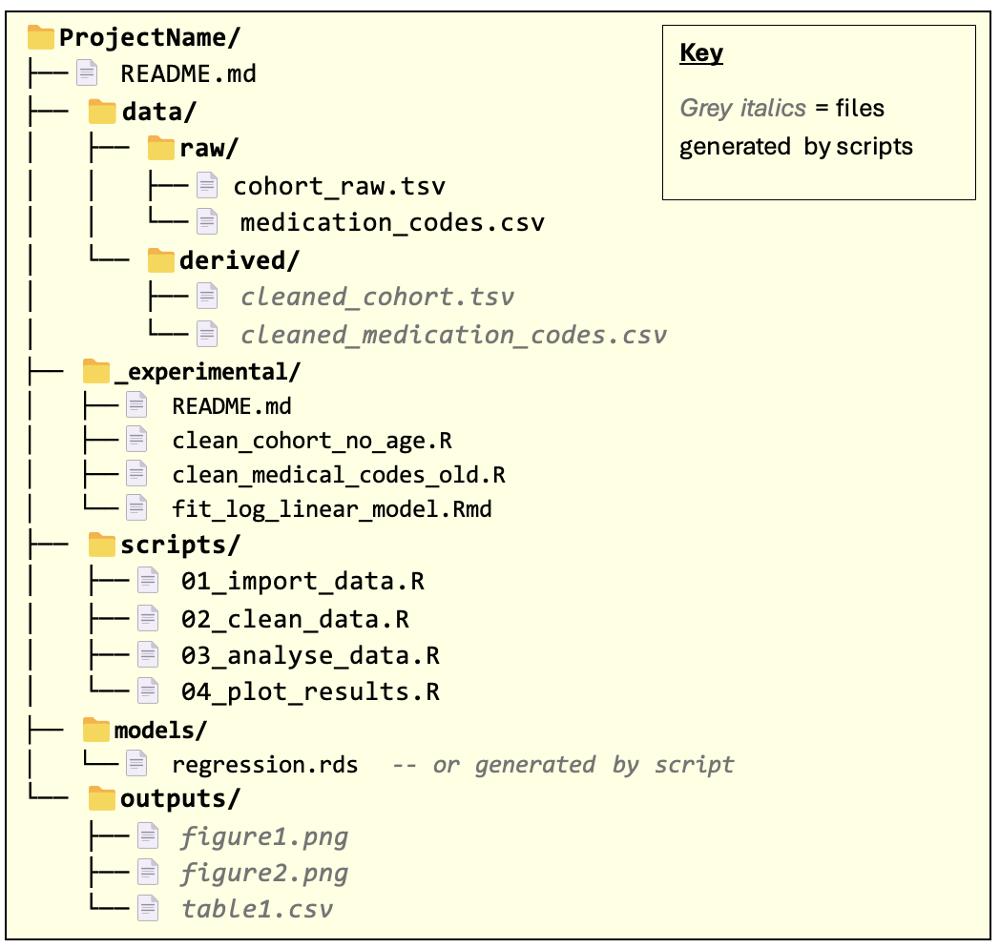
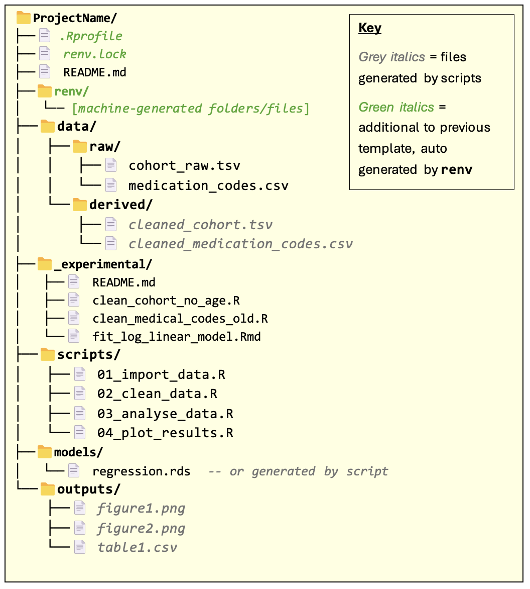
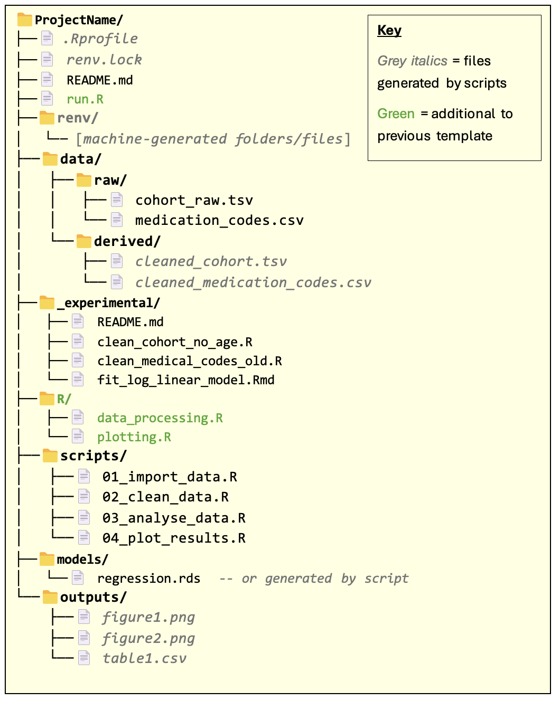

## Project structure templates

This section outlines a series of three standard project structures for analytical workflows. They build on top of each other to provide successive enhancements towards creating a reproducible workflow. They aim to support: 

* Starting a new computational workflow from scratch. 
* Extracting exploratory data analysis into a clear, reproducible workflow after obtaining initial results.
Key features of the templates include:
* A project `README` which describes how the workflow should be run, the software requirements for running the workflow, and other details. (A full template for the `README` can be found in the next section)
* A clear separation between datasets that provide the starting point for the workflow (‘raw’ data) and intermediary datasets that are derived during the workflow (‘derived’ data).
* Running the workflow as a series of scripts, each of which encapsulates a high-level logical step in the workflow.
  
The third and last structure can be considered the ‘gold standard’ to aim for, but you can start with whatever level you feel is most accessible. You can also mix and match elements from different templates that are appropriate to your needs.

The scope of each project folder should be specific: usually limited to a workflow for a single research paper, or multiple closely related papers (e.g. that all use essentially the same data and do very similar data analysis steps).

## Level 1: Basic structure for an organised, reproducible workflow

 
The files within the folders are just example names for illustration: the main thing to note is the folder structure and the `README` file.

Note that the overall project folder should be given a descriptive name.

`README.md` - should contain all the information required for someone to reproduce the results of the workflow. This includes all manual steps needed when running the pipeline. See next section.

Note: we have assumed the markdown format for the `README`, but you can just as well write this file in plain text and save it as `README.txt` if you prefer. For more details, refer to [this](https://coding-for-reproducible-research.github.io/CfRR_Courses/individual_modules/markdown_with_python/Markdown-Fundamentals.html) guide on writing Markdown.

Ensure to document things like:
* Inputs – any external files needed in the first script/step of the analysis, for example CSV files of data. Include any key assumptions about the format or content of the inputs (number columns, columns names etc). 
* Outputs – files the scripts save to disk (plots, summary tables etc); these are the artefacts it creates that are needed by later steps or included in results. Include what file(s) it produces and where to expect them.
* Installation instructions: what R packages are required to run your code? What other software, if any, is needed (e.g. command line tools). Include details of any constraints on versions required for the code to run. Where should data required by the pipeline be saved?
* Note that using renv reduces the burden on specifying which R packages are required, since this is specified in the renv lock file. However, it’s still necessary to separately document any constraints on package versions that apply for running your code.
* Other notes, including known limitations, hardcoded values, or manual steps, anything that helps others (or your future self) understand how the code is intended to run and under what conditions.
* Optionally, consider adding details of future improvements or lines of exploration.
Optionally, you may find it’s clearer to include a README in each folder (data/, scripts/, etc.) with details relevant to that section.

`data/` - this folder contains data required by the pipeline (`data/raw/`) and any intermediary data saved during pipeline execution (`data/derived/`).
* Scripts that fetch/download data sets and save them to the data/raw/ folder are more reliable than getting a user to manually save the data.  Such scripts should live in the scripts/ folder.
* In some cases, it might be impractical to save a copy of some data set to the data/raw/ folder. In this case, data should be imported into an R session directly with an appropriate script in the scripts/ folder. The data set should still be documented in the README.
* If the workflow requires data sets that others in the research group have created (which may have been ‘derived’ from other data), these data sets are still considered raw data in the context of the workflow and so should be saved to `data/raw/`.
  
`_experimental/` - this folder contains R scripts / code snippets that are not used in the final pipeline but may otherwise be useful to keep for future use/reference. 
* The `README.md` file within this folder should provide a brief describe what each file does. It does not need to be very detailed – more just a memory-jogger.
`scripts/` - this folder contains all the scripts required to execute the workflow, from loading in raw data to producing the final pipeline outputs.

* The order in which the scripts are executed, should be documented in the README. It is recommended, though not essential, that the names of the scripts are numbered to reflect the order in which they should be executed.
* Each script must be run from beginning to end as a complete script, i.e. without the need for any manual, interactive intervention. This greatly enhances the reproducibility of the workflow.
* The scripts/ folder may contain R notebooks / Jupyter notebooks as well as conventional R scripts .

`models/` - this folder contains statistical models that are required by or created during the workflow. This may not be relevant for some workflows, in which case it can be left out.
* Like the `data/` folder, you may wish to have subfolders of `models/` to clearly differentiate between models required by the workflow from the outset and models created as part of the workflow.

`outputs/` - this folder contains results, plots, summary tables etc. that are the outputs of the workflow.

* Remark: multiple related workflows.
In cases where the same project folder is being used to contain multiple, closely related workflows (e.g. for creating results for related papers), then the `README` should make it clear how to run each workflow separately.

You may also find it helpful to clearly demarcate data sets / scripts / models / outputs that are unique to particular workflows. For example:
* Consider having separate subfolders of output/, models/, data/derived/, etc. for each workflow.
* Use a naming convention in the scripts/ folder to clearly indicate which scripts are specific to a given workflow.
* 
However you do this, the key thing is to be consistent within the project and document the conventions you choose in the README.

## Level 2: With renv for package versioning

In this template, all the additional `folders/files` are automatically generated from the renv package and don’t require manual editing. 

`renv` is an R package for managing dependencies for an R codebase. It provides the capability for precisely specifying the R packages and versions that were used to run the code (recording these in `renv.lock` file) and allows users to create isolated package ‘environments’ that exactly match the spec.

This is important for reproducibility: users of the code can rerun the analysis using the same packages and versions that the author of the code used.

Note: the `renv.lock` file and `renv/` folder should not be manually changed.

For more information on using renv, consult the package documentation.

## Level 3: Further automation and modularisation

 
`run.R` script

The `run.R` script is a ‘runner’ script used to run all scripts required by the workflow — serving as a "one-stop shop" for reproducing the full analysis. This aids reproducibility by removing the need to manually run the scripts in the `scripts/` folder. It also reduces the amount of instruction required in the README for running the workflow.
* In many cases, the runner script will run all the scripts in the scripts/ folder. In some cases, you might have scripts that don’t need to be run to generate the final outputs but are nevertheless still useful to keep in the scripts/ folder (e.g. for exploratory or supporting analyses). These should be documented separately in the README.
* If the project contains multiple workflows, consider having one run.R script per workflow.
* Instead of an R script, the runner script could be a Bash script (or a batch/PowerShell script on Windows).
  
The `R/` folder
This folder contains R functions and variables that are reused across multiple scripts. For example, you might have a function that performs some common data preparation procedure, or a variable containing plotting parameters used in several plots.

* Scripts in the `scripts/` folder should use the source function in R to bring in the definitions from the R files in the R/ folder.  
* Scripts should not redefine the functions / variables defined in R files within the R/ folder. Doing so introduces the risk of bugs where one script assumes that a function/variable does one thing, but then the function/variable is changed by another script earlier in the pipeline. Redefining objects that reside in other files also makes the logic of the code much more difficult to follow.
